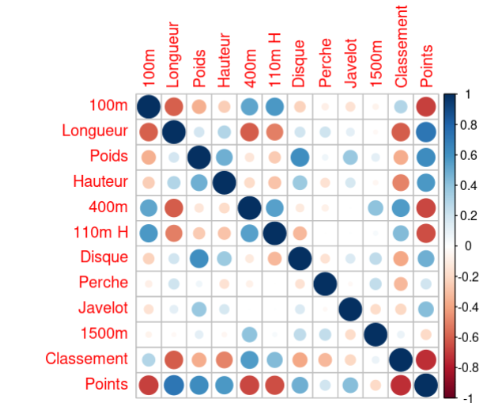
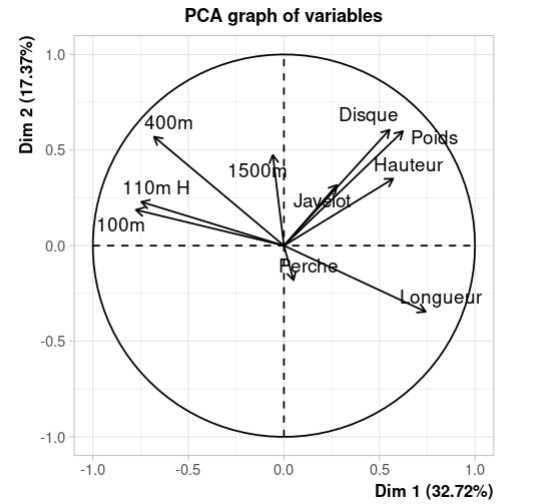

---
---
---

# Remise à niveau corrélation

## 1. Corrélation entre deux variables

La **corrélation de Pearson** mesure la relation linéaire entre deux variables $X$ et $Y$. Elle est donnée par la formule :

$$
r_{X,Y} = \frac{\sum (X_i - \bar{X})(Y_i - \bar{Y})}{\sqrt{\sum (X_i - \bar{X})^2 \sum (Y_i - \bar{Y})^2}}
$$

En notation de covariance et d'écart-type :

$$
r_{X,Y} = \frac{\text{Cov}(X, Y)}{\sigma_X \sigma_Y}
$$

En R, on utilise la fonction `cor()` :

``` r
matrice_cor <- cor(Xquanti)  # Matrice des corrélations
print(matrice_cor)
```

------------------------------------------------------------------------

### Interprétation vectorielle de la corrélation

$$
r_{X,Y} = \frac{\langle X - \bar{X}, Y - \bar{Y} \rangle}{\|X - \bar{X}\| \cdot \|Y - \bar{Y}\|}
$$

*(La corrélation peut être vue comme le **cosinus de l’angle entre deux vecteurs centrés*** $\cos(\theta) = \frac{\mathbf{u} \cdot \mathbf{v}}{\|\mathbf{u}\| \|\mathbf{v}\|}$*)*

------------------------------------------------------------------------

## 2. Différence entre variable centrée et centrée réduite

| Type                | Formule                        | Moyenne | Écart-type |
|---------------------|--------------------------------|---------|------------|
| **Centrée**         | $X - \bar{X}$                  | 0       | Inchangé   |
| **Centrée réduite** | $\frac{X - \bar{X}}{\sigma_X}$ | 0       | 1          |

En R :

``` r
X_centre <- scale(X, center = TRUE, scale = FALSE)  # Centrage uniquement
X_reduit <- scale(X, center = TRUE, scale = TRUE)  # Centrage + réduction
```

------------------------------------------------------------------------

## 3. Lien entre norme et écart-type

L'**écart-type** est proportionnel à la **norme euclidienne** de la variable centrée :

$$
\sigma_X = \frac{\|X - \bar{X}\|}{\sqrt{n-1}}
$$

Si on veut la **moyenne des écarts absolus**, on utilise :

$$
EAM(X) = \frac{1}{n} \sum_{i=1}^{n} |X_i - \bar{X}|
$$

En R :

``` r
EAM <- mean(abs(X - mean(X)))
SD <- sd(X)
```

------------------------------------------------------------------------

## 4. Lecture graphique

### -Correlogramme :

-   Une **corrélation positive** ($r > 0$) signifie que **les deux variables évoluent ensemble** (ex : **100m et 400m**, cercle bleu foncé 🔵)

-   Une **corrélation négative** ($r < 0$) signifie que **quand une variable augmente, l'autre diminue** (ex : **Classement et Points**, cercle rouge foncé 🔴).

-   Une **corrélation neutre (**$r \approx 0$**)** signifie **pas de lien clair** (ex : **Poids et 1500m**, petit cercle clair 🔘)

{width="221"}

``` r
library(corrplot)
corrplot(matrice_cor)
```

### -Cercle de correlation :

Un **cercle de corrélation** en ACP montre **les relations entre variables et leur contribution aux composantes principales** :

-   **Les axes Dim 1 et Dim 2** sont des **composantes principales** expliquant une partie de la variance des données.

-   Le **pourcentage de variance expliquée** par une composante principale $k$ est donné par :

    $$
    \text{Variance expliquée} = \frac{\lambda_k}{\sum \lambda} \times 100
    $$

    où : - $\lambda_k$ est la **valeur propre** de la composante $k$. - $\sum \lambda$ est la **somme des valeurs propres**.

-   **Flèche longue** → variable bien représentée par ces axes.

-   **Flèches proches** → variables **corrélées** (ex : 100m et 400m).

-   **Flèches perpendiculaires** → variables **indépendantes** ( $r \approx 0$, ex : Longueur et Poids).

-   **Flèches opposées** → variables **négativement corrélées**.

-   Pour **orienter les composantes principales**, on s'appuie sur le **cercle de corrélation**. Les variables ayant la **plus grande projection orthogonale** sur un axe sont celles qui **définissent le mieux cet axe**. Cf : [Orientation CP (GoT)](https://youtu.be/VdpNEjStT5g?si=QHf3sETdT7dQidXp&t=534)

    {width="195"}

En R :

``` r
library(FactoMineR)
library(factoextra)

res.pca <- PCA(iris[,1:4], scale.unit = TRUE, graph = FALSE)
fviz_pca_var(res.pca, col.var = "cos2")
```

------------------------------------------------------------------------

## Conclusion

📌 **Corrélation = cosinus d’un angle entre variables centrées**.\
📌 **Le dénominateur est un facteur de normalisation basé sur la norme euclidienne des variables centrées**.\
📌 **L’écart-type n’est pas une simple moyenne des écarts, mais une mesure quadratique de dispersion**.

------------------------------------------------------------------------

Fin du document.
